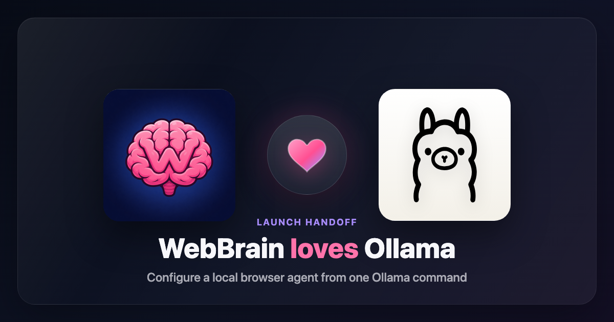

# Fournisseurs et Modèles

---

## Interface Fournisseur (`providers/base.js`)

Chaque fournisseur LLM implémente l'interface `BaseLLMProvider` :

```js
class BaseLLMProvider {
  async chat(messages, options)         // → { content, toolCalls, usage }
  async *chatStream(messages, options)  // → générateur async produisant { type, content }
  get supportsTools()                   // → booléen
  get supportsAskStreaming()            // → booléen
  get supportsVision()                  // → booléen
  get promptTier()                      // → 'compact' | 'mid' | 'full'
  async testConnection()                // → { ok, error?, model? }
}
```

### Options

```js
{
  tools: [...],            // schémas d'outils
  temperature: 0.3,
  maxTokens: 4096,
  stream: false,           // utiliser chatStream au lieu de chat
  extraBody: {},           // champs supplémentaires transmis à l'API
}
```

---

## Fournisseurs Intégrés

| ID Fournisseur | Type | Catégorie | Modèle par défaut | Vision |
|---|---|---|---|---|
| `webbrain_cloud` | `openai` | cloud | `webbrain-cloud 1.0` | Oui |
| `llamacpp` | `llamacpp` | local | (modèle chargé) | Métadonnées auto / surcharge |
| `ollama` | `openai` | local | (modèle chargé) | Auto via `/api/show` / surcharge |
| `lmstudio` | `openai` | local | (modèle chargé) | Métadonnées auto / surcharge |
| `jan` | `openai` | local | (modèle chargé) | Oui (activé par défaut) |
| `vllm` | `openai` | local | (modèle chargé) | Oui (activé par défaut) |
| `sglang` | `openai` | local | (modèle chargé) | Oui (activé par défaut) |
| `localai` | `openai` | local | (modèle chargé) | Métadonnées auto / surcharge |
| `gpt4all` | `openai` | local | (modèle chargé) | Oui (activé par défaut) |
| `local_openai_proxy` | `openai` | local | (requis) | Désactivée / bascule manuelle |
| `webgpu` (Chromium) | `webgpu` | local | LFM2.5 2.6B (valeur par défaut) ou Bonsai 27B en option ; dépôt HF ONNX personnalisé expérimental | Non |
| `azure_openai` | `azure_openai` | cloud | (déploiement) | Bascule manuelle |
| `aws_bedrock` | `aws_bedrock` | cloud | (ID de modèle) | Non |
| `openai` | `openai` | cloud | `gpt-5.6-terra` | Regex nom de modèle |
| `anthropic` | `anthropic` | cloud | `claude-sonnet-4-6` | Regex nom de modèle |
| `gemini` | `openai` | cloud | `gemini-3.1-flash` | Regex nom de modèle |
| `cloudflare` | `openai` | routeur | `@cf/zai-org/glm-5.2` | Regex nom de modèle |
| `mistral` | `openai` | cloud | `mistral-large-latest` | Regex nom de modèle |
| `deepseek` | `openai` | cloud | `deepseek-v4-flash` | Regex nom de modèle |
| `xai` (Grok) | `openai` | cloud | `grok-4.3` | Regex nom de modèle |
| `nvidia` (NIM) | `openai` | routeur | `meta/llama-3.1-8b-instruct` | Regex nom de modèle |
| `groq` | `openai` | routeur | `llama-3.3-70b-versatile` | Regex nom de modèle |
| `minimax` | `openai` | cloud | `minimax-m2.7` | Regex nom de modèle |
| `kimi` | `openai` | cloud | `kimi-k2.5` | Regex nom de modèle |
| `alibaba` (Qwen) | `openai` | cloud | `qwen-max` | Regex nom de modèle |
| `together` | `openai` | routeur | `meta-llama/Llama-3.3-70B-Instruct-Turbo` | Regex nom de modèle |
| `openrouter` | `openai` | routeur | `openrouter/free` | Regex nom de modèle |
| `huggingface` | `openai` | routeur | `zai-org/GLM-5.2` | Regex nom de modèle |
| `fireworks` | `openai` | routeur | `accounts/fireworks/models/llama-v3p3-70b-instruct` | Regex nom de modèle |
| `z_ai` | `openai` | cloud | `glm-5.2` | Regex nom de modèle |

### Catalogue étendu de fournisseurs

WebBrain ajoute 76 cartes désactivées par défaut depuis l’instantané du
catalogue OpenCode au commit
`62e4641235d7847dadc60da37cca8a023dd54fc1`. Avec les cartes existantes,
les Paramètres proposent **106 fournisseurs intégrés sur Chromium** et **105
sur Firefox** ; la différence est le moteur WebGPU local à Chromium. La liste
exacte des identifiants est :

`302ai`, `abacus`, `aihubmix`, `alibaba-coding-plan`,
`alibaba-coding-plan-cn`, `azure-cognitive-services`, `bailing`, `baseten`,
`berget`, `cerebras`, `chutes`, `clarifai`, `cloudferro-sherlock`, `cohere`,
`cortecs`, `deepinfra`, `digitalocean`, `dinference`, `drun`, `evroc`,
`fastrouter`, `friendli`, `google-vertex`, `google-vertex-anthropic`,
`helicone`, `iflowcn`, `inception`, `inference`, `io-net`, `jiekou`, `kilo`,
`kimi-for-coding`, `kuae-cloud-coding-plan`, `llama`, `lucidquery`,
`meganova`, `minimax-cn-coding-plan`, `minimax-coding-plan`, `moark`,
`modelscope`, `morph`, `nano-gpt`, `nebius`, `nova`, `novita-ai`,
`ollama-cloud`, `opencode`, `opencode-go`, `ovhcloud`, `perplexity`,
`perplexity-agent`, `poe`, `privatemode-ai`, `qihang-ai`, `qiniu-ai`,
`requesty`, `scaleway`, `siliconflow`, `siliconflow-cn`, `stackit`,
`stepfun`, `submodel`, `synthetic`, `tencent-coding-plan`, `upstage`, `v0`,
`venice`, `vercel`, `vivgrid`, `vultr`, `wandb`, `xiaomi`,
`zai-coding-plan`, `zenmux`, `zhipuai`, `zhipuai-coding-plan`.

La plupart utilisent Chat Completions compatible OpenAI avec une clé Bearer.
Azure AI Foundry utilise un nom de ressource et `api-key`. Google Vertex AI
utilise projet, région et clé d’autorisation Google via `x-goog-api-key`;
la région `global` utilise `aiplatform.googleapis.com`, et Vertex Anthropic
utilise `rawPredict` / `streamRawPredict` avec les hôtes multirégion `us` et
`eu`. Perplexity Agent
utilise l’API Responses. La carte Cloudflare existante prend désormais en
charge un identifiant AI Gateway facultatif ; pour les modèles `@cf/`, un
champ vide utilise automatiquement la passerelle `default`.

Les réponses sont diffusées pendant les tours Ask interactifs lorsque
`supportsAskStreaming` est actif. Un flux interrompu efface le texte partiel,
réessaie une seule fois sans diffusion et désactive la diffusion pour le reste
de l’exécution. Act, Dev, les tâches planifiées, cloud et Continue restent sans
diffusion. L’utilisation de jetons fournie par le service est enregistrée
directement ; si elle est absente, WebBrain enregistre une estimation prudente
fondée sur le nombre de caractères afin que la diffusion ne contourne pas la
limite de coût configurée.

Entrées volontairement exclues : `github-models` (retrait de GitHub Models le
30 juillet 2026), `github-copilot` (abonnement/OAuth), `gitlab` et
`sap-ai-core` (authentification, découverte et protocoles spécifiques).

### Fournisseurs Locaux

Sur Chromium, **WebGPU (dans le navigateur)** est un fournisseur local sans
point de terminaison. Le sélecteur Apocalypse propose deux préréglages
embarqués : **LFM2.5 2.6B** (`q4f16`, environ 1,55 Go) via Transformers.js /
ONNX, toujours le défaut et téléchargé à l’activation d’Apocalypse ; et
**Bonsai 27B** (`Q1_0`, environ 3,8 Go) via un worker bitgpu optionnel, jamais
téléchargé automatiquement. Bonsai exige un GPU haut de gamme (16 Go+ de
RAM/VRAM recommandés). LFM et Bonsai ne sont jamais résidents GPU en même
temps. Firefox n’expose pas cette carte.

Neuf fournisseurs à terminaison locale sont activés par défaut. Les moteurs de
modèles n'exigent pas de clé sauf si le serveur utilise l'authentification ; la
carte proxy générique exige une clé client :

- **llama.cpp** : `http://localhost:8080` — exécutez `llama-server -m model.gguf`
- **Ollama** : `http://localhost:11434/v1` — `ollama serve`, ou `ollama launch webbrain --model <model>`
- **LM Studio** : `http://localhost:1234/v1` — le serveur d'inférence local de LM Studio
- **Jan** : `http://localhost:1337/v1` — le serveur API local compatible OpenAI de Jan
- **vLLM** : `http://localhost:8000/v1` — le serveur compatible OpenAI de vLLM
- **SGLang** : `http://localhost:30000/v1` — le serveur compatible OpenAI de SGLang
- **LocalAI** : `http://localhost:8080/v1` — le serveur compatible OpenAI de LocalAI
- **GPT4All** : `http://localhost:4891/v1` — le serveur API local de GPT4All
- **Proxy local compatible OpenAI** : `http://127.0.0.1:8317/v1` — passerelle
  locale générique authentifiée ; le modèle et la clé API client sont requis

#### Exemple de proxy d'abonnement (CLIProxyAPI)

La carte **Proxy local compatible OpenAI** peut joindre une instance
[CLIProxyAPI](https://github.com/router-for-me/CLIProxyAPI) gérée séparément.
Installez-le via le [guide de démarrage officiel](https://help.router-for.me/introduction/quick-start)
ou compilez-le (`go build -o cli-proxy-api ./cmd/server`), copiez
`config.example.yaml` vers `config.yaml`, puis configurez `host: "127.0.0.1"`,
`port: 8317` et une valeur forte et aléatoire dans `api-keys`. Authentifiez le
compte avec `./cli-proxy-api --config ./config.yaml --codex-login` ou
`--claude-login`. Gemini CLI nécessite le
[plugin officiel](https://github.com/router-for-me/cpa-plugin-gemini-cli) :
activez les plugins de confiance, installez `gemini-cli` depuis le Plugin Store
officiel, redémarrez le proxy, puis utilisez `--geminicli-login` (voir le
[guide de gestion](https://help.router-for.me/management/api#plugins)). Démarrez enfin avec
`./cli-proxy-api --config ./config.yaml`. Dans WebBrain, conservez l'URL
`http://127.0.0.1:8317/v1`, saisissez la même clé, chargez les modèles,
sélectionnez-en un puis testez la connexion.

Ne publiez pas ce proxy sur le réseau local ou Internet : l'hôte vide par
défaut écoute toutes les interfaces, TLS est désactivé par défaut et une liste
`api-keys` vide autorise les requêtes sans authentification. Ce chemin est
expérimental et communautaire. Le processus est local, mais il peut transmettre
le contexte à un compte en amont ; les identifiants OAuth amont restent dans
CLIProxyAPI.

Ollama, llama.cpp, LM Studio et LocalAI utilisent `visionMode: auto` par défaut.
WebBrain lit les métadonnées natives du modèle sélectionné avant l'enrichissement et
n'envoie des captures que si le serveur déclare explicitement l'entrée image.
Une détection indisponible ou malformée reste en texte seul pour ce tour et
sera retentée plus tard. Si le champ Modèle est vide, la capacité du modèle
chargé est revérifiée à chaque tour afin de suivre les changements côté serveur.
Les réglages proposent Automatique, Forcer
l'activation et Désactivé ; les autres fournisseurs locaux conservent leur
interrupteur explicite actuel.

#### Relais de lancement Ollama (préversion)

<p align="center">
  
</p>

WebBrain prend aujourd'hui en charge Ollama via le fournisseur local compatible
OpenAI. Un nouveau relais `ollama launch webbrain --model <model>` peut aussi
configurer WebBrain automatiquement, mais il n'est pas encore intégré à Ollama
en amont. Pour l'instant, essayez-le depuis la [branche
`codex/ollama-webbrain-launch-handoff` de
`esokullu/ollama`](https://github.com/esokullu/ollama/tree/codex/ollama-webbrain-launch-handoff) ;
nous espérons qu'Ollama l'intégrera en amont.

```bash
git clone https://github.com/esokullu/ollama.git
cd ollama
git switch codex/ollama-webbrain-launch-handoff
cmake -S . -B build -G Ninja -DOLLAMA_MLX_BACKENDS=
cmake --build build --parallel 8

OLLAMA_ORIGINS="chrome-extension://*,moz-extension://*" ./ollama serve
./ollama launch webbrain --model <model>
```

**Fenêtre de contexte.** Chargez les modèles locaux avec **au moins une fenêtre de contexte de 16k tokens** pour des exécutions d'agent fiables — c'est le minimum utilisable. 8k peut fonctionner avec le niveau Compact sélectionné ; 4k est trop petit pour contenir le prompt système + les schémas d'outils. L'agent lit la fenêtre depuis `provider.contextWindow` (`providers/base.js`) pour piloter l'auto-compaction ; quand une configuration de fournisseur ne définit pas `contextWindow`, les fournisseurs locaux utilisent par défaut une valeur prudente de **16k** (cloud/routeur par défaut à 128k). **Tester la connexion** / **Charger les modèles** détectent pour **llama.cpp**, **Ollama** et **LM Studio** quand c'est rapporté (llama.cpp `GET /props` `n_ctx`, Ollama `GET /api/ps` puis `/api/show` `num_ctx`, LM Studio `/api/v0/models` `loaded_context_length`). La détection rafraîchit le 16k par défaut ; elle réduit une surcharge manuelle plus grande seulement depuis le contexte live/runtime (pas depuis Ollama `/api/show` seul). Jan / vLLM / SGLang / LocalAI ne détectent pas encore. Vous pouvez toujours définir `config.contextWindow` explicitement, et le serveur de modèle doit effectivement être démarré avec cette taille de contexte (par exemple `llama-server -c 16384`).

### Niveaux de prompt/outils et modes

Le niveau du fournisseur et le mode de conversation sont des paramètres indépendants :

- **Niveau** (`compact | mid | full`) est un paramètre du fournisseur. Il contrôle quel prompt système Act et quel sous-ensemble d'outils d'agent navigateur normaux le modèle reçoit.
- **Mode** (`ask | act | dev`) est sélectionné par l'utilisateur par conversation/message. Il contrôle si la requête est en lecture seule, action navigateur normale, ou travail de développement/inspection de page.

`provider.promptTier` résout le niveau actif. Les fournisseurs cloud sont forcés au niveau Full. Les fournisseurs locaux utilisent Mid par défaut. Les fournisseurs OpenRouter/routeur utilisent Full par défaut sauf modification explicite. Les configurations existantes qui définissent encore l'ancien booléen `useCompactPrompt` sont mappées vers Compact.

| Niveau | Classe de modèle visée | Surface d'outils normale |
|---|---|---|
| `compact` | très petits modèles / locaux | Prompt le plus court et un petit ensemble d'outils Act normaux. Pas d'outils de planification, d'iframe, de téléchargement de ressource, ou d'interface DOM/UI avancée. |
| `mid` | modèles locaux capables | Prompt équilibré et outils de tâches courantes : téléchargements, planification, outils iframe, vérification de formulaire, et `download_resource_from_page`, tout en excluant les solutions de repli UI/DOM avancées réservées à Full. |
| `full` | modèles frontière/cloud ou grands modèles locaux | Prompt Act normal complet et solutions de repli avancées telles que survol, glisser-déposer, trames, et shadow DOM. |

Le mode Ask ignore le niveau du fournisseur et reste en lecture seule. Le mode Act utilise les outils normaux du niveau sélectionné. Le mode Dev nécessite Mid ou Full, utilise le prompt Act sélectionné, ajoute `SYSTEM_PROMPT_DEV_APPENDIX`, et ajoute des outils source/style propres à Dev plus l'inspection étendue shadow/trame pour le débogage niveau Mid. Dev en Compact est bloqué avant l'envoi d'une requête LLM.

### Détection de la Vision

| Fournisseur | Mécanisme |
|---|---|
| Compatible OpenAI | Regex sur le nom du modèle (`gpt-4o`, `gpt-5`, `claude-3`, `claude-sonnet-4`, `gemini-2.0-flash`, etc.) |
| Anthropic | Patterns `claude-(3\|sonnet-4\|opus-4)` |
| Ollama | `POST /api/show` `capabilities`, avec replis historiques `projector_info` / `.vision.` |
| llama.cpp | `GET /props` → `modalities.vision`, avec Automatique / Forcer / Désactivé |
| LM Studio | `GET /api/v1/models` → `capabilities.vision`, puis ancien `/api/v0/models` `type` |
| LocalAI | `GET /v1/models/capabilities` → `input_modalities` / `capabilities` |
| Jan / vLLM / SGLang | Interrupteur explicite `supportsVision` dans la configuration (via le fournisseur OpenAI) |

La détection est liée au fournisseur, au modèle exact et à l'URL de base. Les
requêtes simultanées sont regroupées et une réponse tardive d'une ancienne
configuration ne peut pas modifier la configuration actuelle. Un fournisseur
de vision dédié conserve le routage séparé existant.

### Conversion Anthropic

Lorsque le fournisseur actif est Anthropic, l'agent convertit les messages au format OpenAI :

| Format OpenAI | Format Anthropic |
|---|---|
| Message `system` | Champ `system` (niveau supérieur) |
| `assistant` + `tool_calls` | Blocs de contenu `assistant` + `tool_use` |
| Rôle `tool` | Blocs de contenu `user` + `tool_result` |
| `image_url` (URL de données) | Bloc source `image` |

---

## ProviderManager (`providers/manager.js`)

Gère le cycle de vie des fournisseurs :

```js
const pm = new ProviderManager();

await pm.load();                    // Chargement depuis chrome.storage.local
await pm.save();                    // Persistance vers chrome.storage.local
pm.getActive();                     // Obtient l'instance du fournisseur actif
await pm.setActive('openai');       // Change de fournisseur actif
await pm.updateProvider('openai', { model: 'gpt-5' }); // Met à jour la configuration
pm.getAll();                        // Toutes les configurations de fournisseurs (pour l'interface Paramètres)
await pm.testProvider('openai');    // Teste la connexion
```

### Recherche dans les Paramètres

L'index de recherche des Paramètres comprend les identifiants et libellés des
fournisseurs, le type/la catégorie, le modèle, l'URL de base, les libellés et
espaces réservés des champs, les suggestions et les options de compatibilité.
Les cartes correspondantes sont classées par nom/identifiant exact, puis
préfixe, puis sous-chaîne, puis correspondance dans les champs uniquement.
L'ordre original départage les égalités et le fournisseur sélectionné reste
visible à travers les filtres de catégorie.

### Persistance de la Configuration

Les configurations sont stockées dans `chrome.storage.local` sous la clé `providers`, fusionnées avec les valeurs par défaut. Les valeurs par défaut fournissent la STRUCTURE (quelles clés de fournisseur existent) ; les configurations stockées remplacent les valeurs par clé. Cela permet aux mises à jour qui introduisent de nouvelles entrées de fournisseur de fonctionner sans que les utilisateurs aient à vider le stockage.

Les entrées de fournisseur obsolètes (`webbrain`, `openai_subscription`,
`claude_subscription`) sont filtrées.

### Plafonds de Coût

Les paramètres exposent des plafonds de coût cloud pour la session et le total. L'agent préfère une valeur `usage.cost`/`usage.cost_usd` rapportée par le fournisseur lorsqu'elle est présente (OpenRouter la rapporte directement). Pour les fournisseurs cloud directs qui ne retournent que des compteurs de tokens, WebBrain estime les dépenses à partir des champs de configuration du fournisseur :

- `inputCostPerMillionUsd`
- `cacheReadCostPerMillionUsd`
- `cacheWriteCostPerMillionUsd` (écritures de cache de 5 minutes ou sans durée précisée)
- `cacheWrite1hCostPerMillionUsd`
- `outputCostPerMillionUsd`

OpenAI inclut les lectures et écritures de cache dans le total des tokens d'entrée (`prompt_tokens_details.cached_tokens` / `cache_write_tokens`, ou les équivalents `input_tokens_details` de l'API Responses) ; WebBrain soustrait donc les deux avant d'appliquer le tarif d'entrée normal, et facture les écritures avec `cacheWriteCostPerMillionUsd`. Anthropic et Bedrock rapportent séparément l'entrée normale, les lectures du cache et les écritures dans le cache ; ces compteurs sont donc additionnés comme catégories de facturation distinctes. Ils peuvent également distinguer les écritures de cache de 5 minutes et d'une heure.

Ces tarifs sont modifiables dans la carte du fournisseur afin que le prix des modèles personnalisés puisse être ajusté sans modification de code. Si un tarif propre au cache est absent, le tarif d'entrée normal est utilisé ; si le tarif d'écriture d'une heure est absent, le tarif général d'écriture dans le cache est utilisé. Si un fournisseur distant facturé retourne des compteurs sans tarifs d'entrée/sortie configurés, l'agent utilise des valeurs prudentes (`3$` en entrée / `15$` en sortie par million de tokens). Pour chaque requête en streaming, seul le dernier instantané cumulatif d'utilisation est comptabilisé. Les fournisseurs locaux ne sont pas comptabilisés.

### Fournisseur de Vision Dédié

L'utilisateur peut configurer un fournisseur de vision séparé pour la description de capture d'écran. L'agent appelle ce fournisseur en sous-requête pour obtenir une description textuelle du viewport, puis transmet uniquement la description (pas l'image brute) au fournisseur de planification principal. Cela réduit les coûts de tokens lorsque le fournisseur principal est textuel uniquement :

```js
const vision = await providerManager.getVisionProvider();
// Retourne une instance OpenAICompatibleProvider ou null
```

### Fournisseur de Transcription

Utilisé par Tab Recorder pour la transcription Whisper. Passe par les fournisseurs configurés dans l'ordre de priorité : OpenAI → Groq → LM Studio → llama.cpp. La liste d'exclusion ignore les fournisseurs connus pour ne pas héberger Whisper (Anthropic, Gemini, Mistral, DeepSeek, xAI, Nvidia).

---

## Ajouter un Fournisseur

1. **Créez la classe du fournisseur** dans `src/chrome/src/providers/<nom>.js` implémentant `BaseLLMProvider`
2. **Ajoutez la configuration par défaut** à `_defaultConfigs()` dans `manager.js`
3. **Ajoutez le cas dans la fabrique** dans `_createProvider()`
4. **Enregistrez l'import** dans `manager.js`
5. **Ajoutez la gestion spécifique au fournisseur** dans l'agent si nécessaire (par exemple, la conversion de format de message d'Anthropic)
6. **Miroir vers Firefox** (`src/firefox/src/providers/`)

### Pour les fournisseurs compatibles OpenAI

Si le fournisseur utilise le format d'API OpenAI `/v1/chat/completions`, vous avez seulement besoin d'ajouter une entrée de configuration par défaut — `OpenAICompatibleProvider` gère le reste :

```js
myprovider: {
  type: 'openai',
  category: 'cloud',
  label: 'Mon Fournisseur',
  providerName: 'myprovider',
  baseUrl: 'https://api.myprovider.com/v1',
  model: 'my-model',
  supportsStreamUsageOptions: false,
  apiKey: '',
  enabled: false,
},
```

La vision est auto-détectée via une regex sur le nom du modèle. Si le fournisseur a un ensemble connu de modèles de vision, ajoutez-les à la regex dans `openai.js`. Définissez `supportsStreamUsageOptions: true` uniquement pour les fournisseurs qui acceptent `stream_options.include_usage` de style OpenAI ; laissez-le à false lorsqu'un fournisseur retourne l'utilisation sans accepter ce champ de requête.
