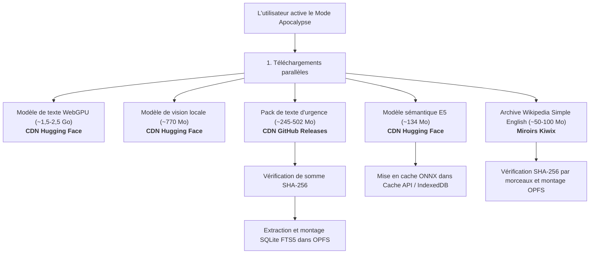

# Téléchargements distants et sources de données

Ce document décrit tous les téléchargements distants effectués par WebBrain, les origines et serveurs auxquels ils se connectent, les déclencheurs exacts, l'ordre d'exécution, les procédures de vérification d'intégrité et l'emplacement de stockage local.

---

## 1. Vue d'ensemble et principes de confidentialité

WebBrain est conçu pour minimiser les dépendances réseau distantes. Tous les téléchargements appartiennent à trois catégories :
1. **Poids de modèles d'IA publics** (pour l'inférence locale via WebGPU et Transformers.js / ONNX Runtime).
2. **Archives de connaissances sous licence libre et bases de données RAG** (archives Wikipedia openZIM, packs d'index SQLite FTS5 et vecteurs).
3. **Références de terrain du domaine public** (documents PDF et guides de survie).

### Garanties de confidentialité
- **Aucune télémétrie ni suivi** : Aucun message de discussion, historique de navigation, URL, capture d'écran, jeton ou identifiant n'est envoyé lors des téléchargements.
- **Requêtes HTTPS GET/Range statiques pures** : Tous les téléchargements utilisent des requêtes standard HTTPS `GET` ou `Range` vers des CDN publics, Hugging Face ou GitHub Releases.
- **Vérification stricte** : Tous les fichiers de modèles, archives et bases de données font l'objet d'une validation structurelle, d'une vérification de somme de contrôle SHA-256 ou d'une vérification par morceaux Metalink avant montage ou activation.

---

## 2. Catalogue des serveurs distants et artefacts

| Composant | Serveur distant / Origine | Description de l'origine | Taille typique | Protocole / Méthode | Somme de contrôle & Intégrité | Destination de stockage local |
| :--- | :--- | :--- | :--- | :--- | :--- | :--- |
| **Modèle de texte WebGPU** | `huggingface.co` / CDN Hugging Face | Dépôt officiel Hugging Face hébergeant les poids ONNX / SafeTensors (ex. SmolLM2, Llama-3.2) | ~1,5 – 2,5 Go | HTTPS GET (pipeline Transformers.js) | Hash SHA-256 Git LFS Hugging Face | Cache API du navigateur & IndexedDB (`transformers-cache`) |
| **Modèle de vision locale** | `huggingface.co` / CDN Hugging Face | Poids ONNX pour la description locale de captures d'écran (LFM2.5-VL / SmolVLM) | ~770 Mo | HTTPS GET (pipeline Transformers.js) | Hash SHA-256 Git LFS Hugging Face | Cache API du navigateur & IndexedDB (`transformers-cache`) |
| **Pack de texte d'urgence & Index SQLite** | `github.com/webbrain-one/emergency-box-corpus` (GitHub Releases) | Fichiers de référence du domaine public, base SQLite FTS5 préconstruite et vecteurs E5 | ~245 Mo (ZIP compressé) | Flux de téléchargement continu avec reprise `Range: bytes={offset}-` | Comparaison stricte du hash **SHA-256** avec le descripteur de version avant activation | OPFS (`webbrain-offline-rag/emergency-box-text/`) & IndexedDB (`webbrain_offline_rag`) |
| **Modèle sémantique multilingue** | `huggingface.co` / CDN Hugging Face (`Xenova/multilingual-e5-small`) | Poids ONNX pour le plongement de requêtes et la recherche vectorielle / réordonnancement | ~134 Mo | HTTPS GET (ONNX Runtime Web / Transformers.js) | Vérification SHA-256 via manifeste Transformers.js | Cache API du navigateur & IndexedDB (`transformers-cache`) |
| **Archive ZIM Wikipedia** | `library.kiwix.org` / `download.kiwix.org` / Miroirs Wikimedia | Archives openZIM Kiwix contenant des éditions Wikipedia compressées | ~50 Mo – 50+ Go | Résolution XML Metalink + téléchargement par morceaux | Vérification **SHA-256** par morceau selon les blocs Metalink | OPFS (`webbrain_apocalypse_mode`) |
| **PDFs d'urgence (Emergency Box)** | `openstax.org`, Internet Archive ou miroirs désignés | Manuels libres OpenStax et guides de terrain de survie/médicaux | 5 – 50 Mo par document | Téléchargement direct HTTPS | Vérification de longueur et hachage SHA-256 | IndexedDB (`webbrain_emergency_box` store `resources`) |
| **Transcription vocale locale** | `huggingface.co` / CDN Hugging Face (`Xenova/whisper-tiny` / `base`) | Poids ONNX pour la transcription locale voix-vers-texte | ~40 – 75 Mo | HTTPS GET (pipeline Transformers.js) | Vérification SHA-256 via manifeste Transformers.js | Cache API du navigateur & IndexedDB (`transformers-cache`) |

---

## 3. Déclencheurs de téléchargement et ordre d'exécution

### A. Séquence automatique en Mode Apocalypse
Lors de l'activation du **Mode Apocalypse** (ou à l'ouverture de `apocalypse-mode.html` avec le mode actif) :

1. **Vérifications préalables** : Détection des capacités WebGPU et estimation de l'espace disque disponible.
2. **Téléchargements parallèles en arrière-plan** :
   - Modèle de texte WebGPU (~1,5-2,5 Go depuis Hugging Face)
   - Modèle de vision locale (~770 Mo depuis Hugging Face)
   - Pack de texte d'urgence (~245 Mo depuis GitHub Releases $\rightarrow$ vérification SHA-256 $\rightarrow$ extraction $\rightarrow$ enregistrement SQLite FTS5 dans OPFS)
   - Modèle sémantique multilingue E5 (~134 Mo depuis Hugging Face)
   - Archive Wikipedia en anglais simple (~50-100 Mo depuis Kiwix)
3. **Suivi unifié des téléchargements** : Le panneau flottant persistant (`download-tracker.js`) synchronise l'état et la vitesse sur toutes les pages de l'extension.

---

## 4. Reprise et tolérance aux pannes

- **Flux HTTP Range avec reprise** : Les téléchargements enregistrent en permanence le curseur d'octets. Si un onglet se ferme, la réouverture reprend là où elle s'était arrêtée.
- **Vérification par morceaux Metalink** : Chaque bloc ZIM est validé individuellement.
- **Mises à jour transactionnelles** : L'ancienne version reste active jusqu'à ce que la nouvelle soit entièrement téléchargée et validée.
