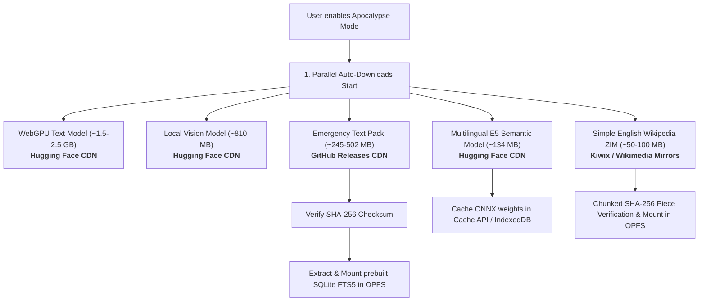

# Remote Downloads & Data Sources

This document describes all remote network downloads performed by WebBrain, the remote origins and servers they connect to, the exact triggers and sequence of downloads, integrity verification procedures, and where downloaded assets are stored locally.

---

## 1. Overview & Privacy Principles

WebBrain is designed to minimize remote network dependencies. All downloads fall into three categories:
1. **Public AI model weights** (for local on-device inference via WebGPU and Transformers.js / ONNX Runtime).
2. **Open-licensed knowledge archives & RAG databases** (openZIM Wikipedia archives, SQLite FTS5 index packs, and vector embeddings).
3. **Public-domain emergency field references** (PDF documents and survival guides).

### Privacy Guarantees
- **No telemetry or user tracking**: No chat messages, browsing histories, page URLs, screenshots, tokens, or identifiers are transmitted when performing downloads.
- **Pure static GET/Range requests**: All downloads use standard HTTPS `GET` or `Range` requests against public CDNs, Hugging Face, or GitHub Releases.
- **Strict verification**: All model files, archives, and databases undergo structural validation, SHA-256 checksum verification, or Metalink piece verification before being mounted or activated.

---

## 2. Remote Servers and Artifact Catalog

| Component | Remote Server / Origin | Origin Description | Typical Size | Protocol / Method | Checksum & Integrity | Local Storage Destination |
| :--- | :--- | :--- | :--- | :--- | :--- | :--- |
| **WebGPU Text Model** | `huggingface.co` / Hugging Face CDN | Official Hugging Face model repository hosting ONNX / SafeTensors weights (e.g., SmolLM2, Llama-3.2) | ~1.5 – 2.5 GB | HTTPS GET (Transformers.js pipeline) | Hugging Face Git LFS SHA-256 hash | Browser Cache API & IndexedDB (`transformers-cache`) |
| **Local Vision Model** | `huggingface.co` / Hugging Face CDN | `webbrain-one/webbrain-vl-2-450M-onnx` weights for local screenshot description and UI analysis | ~810 MB | HTTPS GET (Transformers.js pipeline) | Hugging Face Git LFS SHA-256 hash | Browser Cache API & IndexedDB (`transformers-cache`) |
| **Emergency Text Pack & SQLite Index** | `github.com/webbrain-one/emergency-box-corpus` (GitHub Releases CDN) | Release assets for curated public-domain field references, prebuilt SQLite FTS5 database, and precomputed E5 embeddings | ~245 MB (compressed ZIP) | Resumable HTTP `Range: bytes={offset}-` streaming fetch | Strict **SHA-256** hash comparison against hardcoded release descriptor before activation | OPFS (`webbrain-offline-rag/emergency-box-text/`) & IndexedDB (`webbrain_offline_rag`) |
| **Multilingual Semantic Model** | `huggingface.co` / Hugging Face CDN (`Xenova/multilingual-e5-small`) | ONNX weights for multilingual query embedding and vector search / candidate reranking | ~134 MB | HTTPS GET (ONNX Runtime Web / Transformers.js) | SHA-256 verification via Transformers.js manifest | Browser Cache API & IndexedDB (`transformers-cache`) |
| **Wikipedia ZIM Archive** | `library.kiwix.org` / `download.kiwix.org` / Wikimedia Mirrors | Kiwix openZIM archives containing compressed Wikipedia editions (e.g. Simple English) | ~50 MB – 50+ GB | Metalink XML resolution + piece-by-piece chunked HTTPS download | Chunked **SHA-256** piece verification per Metalink block boundaries | OPFS (`webbrain_apocalypse_mode`) |
| **Emergency Field PDFs** | `openstax.org`, Internet Archive, or designated mirrors | OpenStax open textbooks and public-domain survival/medical field manuals | 5 – 50 MB per document | Direct streaming HTTPS fetch | Content-length and SHA-256 document hashing | IndexedDB (`webbrain_emergency_box` store `resources`) |
| **Local Voice Transcription** | `huggingface.co` / Hugging Face CDN (`Xenova/whisper-tiny` / `base`) | ONNX weights for local speech-to-text audio transcription | ~40 – 75 MB | HTTPS GET (Transformers.js pipeline) | SHA-256 verification via Transformers.js manifest | Browser Cache API & IndexedDB (`transformers-cache`) |

---

## 3. Download Triggers & Execution Flow

### A. Apocalypse Mode Auto-Download Sequence
When a user turns on **Apocalypse Mode** (or opens `apocalypse-mode.html` with Apocalypse Mode already enabled), WebBrain initiates the offline readiness sequence. The sequence runs as follows:



```
[User Opts In / Enables Apocalypse Mode]
   │
   ├─► 1. Preflight System Checks:
   │      - Check WebGPU device and adapter capabilities
   │      - Estimate OPFS and storage quota availability
   │
   ├─► 2. Parallel Background Downloads (Active Tab + Service Worker / Offscreen):
   │      ├── [WebGPU Text Model] (Offscreen document, ~1.5-2.5 GB from Hugging Face)
   │      ├── [Local Vision Model] (Offscreen document, ~810 MB from Hugging Face)
   │      ├── [Emergency Text Pack] (Tab stream, ~245 MB from GitHub Releases)
   │      │     └── Verify SHA-256 ──► Extract ZIP ──► Register SQLite FTS5 in OPFS SAH-pool
   │      ├── [Multilingual E5 Semantic Model] (Tab stream, ~134 MB from Hugging Face)
   │      │     └── Cache ONNX weights for local vector search & reranking
   │      └── [Simple English Wikipedia ZIM] (Background worker, ~50-100 MB from Kiwix)
   │            └── Download Metalink XML ──► Stream pieces ──► Verify chunk hashes ──► Mount ZIM
   │
   └─► 3. Shared Download Tracker (`download-tracker.js`):
          - Injects floating footer tracker showing live speed, ETA, and progress for all streams
          - Broadcasts state across tabs via `BroadcastChannel('webbrain-emergency-download-state')`
```

### B. Manual / On-Demand Downloads

1. **Wikipedia Library Selection (`wikipedia-library.html`)**:
   - The user selects a specific language edition or size tier (Starter, Mini, No-Pic, or Full).
   - WebBrain queries `library.kiwix.org` for the OPDS catalog entry and resolves the corresponding `.meta4` (Metalink) file.
   - The user reviews the byte size, license notice, and storage requirements before confirming.
   - The background worker downloads the file in verified chunks, storing the result in OPFS.

2. **Emergency Box Field Documents (`emergency-box.html`)**:
   - The user selects a collection kit or individual field document (e.g., Wilderness First Aid, Disaster Sanitation).
   - WebBrain streams the PDF file into the local `webbrain_emergency_box` IndexedDB store.

3. **Local Whisper Speech-to-Text (`sidepanel.js`)**:
   - Triggered when the user clicks the microphone button for the first time with local voice input configured.
   - Downloads the quantized Whisper model from Hugging Face into the browser's Cache API.

---

## 4. Resumption, Fault Tolerance, and Storage Lifecycle

### Resumable HTTP Range Streaming
- The Emergency text pack download tracks byte offsets continuously in IndexedDB.
- If a tab is navigated away from or closed during a download, the connection aborts cleanly and saves its `bytesReceived` cursor.
- When reopened, WebBrain issues an HTTP `Range: bytes={bytesReceived}-` header to resume downloading without re-fetching existing bytes.

### Piece-by-Piece Metalink Verification
- Wikipedia ZIM archives use Metalink piece boundaries (typically 1 MB to 4 MB per block).
- Each piece is verified against its published SHA-256 checksum before writing to OPFS.
- If a background worker is terminated by the browser during a piece write, the job restarts from the last valid piece upon the next alarm or page launch.

### Transactional Upgrades
- When an updated Emergency text pack or Wikipedia archive is installed, the active version is not replaced until the new archive has passed full SHA-256 verification and index integrity tests.
- A corrupted or interrupted download never invalidates the currently installed reference library.

---

## 5. Storage Summary

| Storage Layer | Used For | Eviction & Persistence |
| :--- | :--- | :--- |
| **OPFS (Origin Private File System)** | Wikipedia `.zim` archives, Emergency Text Pack plaintext files, and SQLite FTS5 SAH-pool databases | Persistent extension storage. Isolated from regular web page caches. |
| **Cache API / IndexedDB (`transformers-cache`)** | WebGPU text model weights, Vision model weights, E5 semantic model, and Whisper transcription weights | Browser-managed model cache. |
| **IndexedDB (`webbrain_emergency_box`)** | User-selected Emergency Box PDF field manuals and catalog manifests | Persistent extension storage. |
| **IndexedDB (`webbrain_apocalypse_mode`, `webbrain_offline_rag`)** | Archive metadata, download cursor offsets, active version pointers, and filter configurations | Persistent lightweight metadata. |
