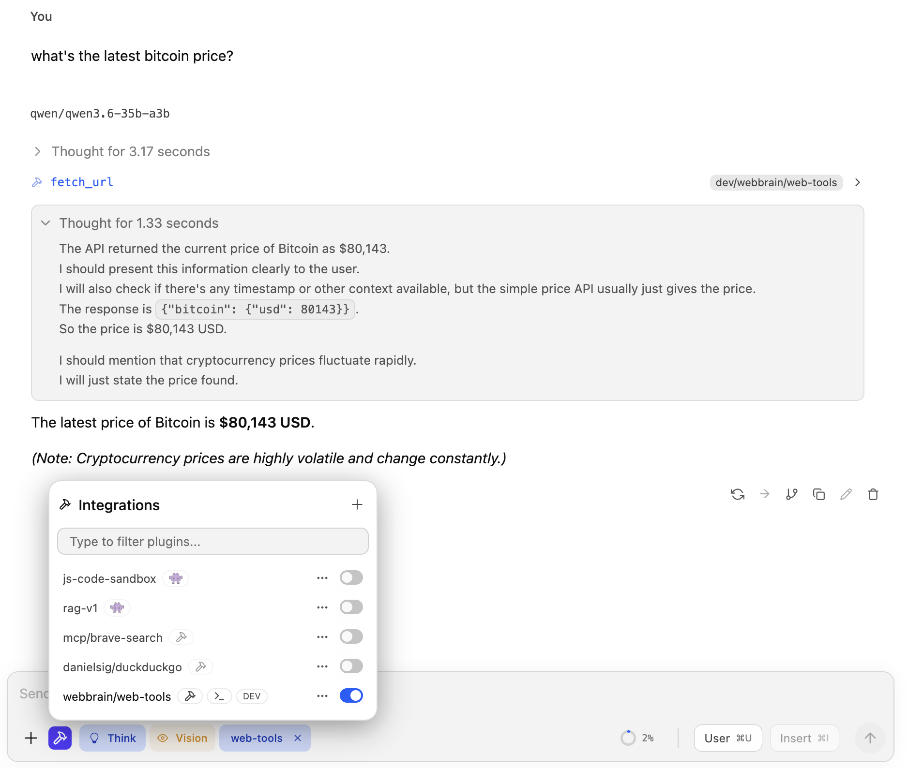

# WebBrain Web Tools — LM Studio plugin

> Listing on LM Studio Hub: `webbrain/web-tools` (owner `webbrain`, name `web-tools`,
> public) — https://lmstudio.ai/webbrain/web-tools
>
> **One-click install while LM Studio is open:** click the *Run in LM Studio*
> button on the Hub page, or open this URL on your machine:
>
> ```
> lmstudio://plugin?owner=webbrain&name=web-tools
> ```
>
> That triggers LM Studio to download the plugin from the Hub into your local
> plugins directory. You can also install from inside LM Studio (integrations
> icon next to the chat input → toggle **webbrain/web-tools** on). For a CLI
> install, clone the artifact, enter the cloned directory, then install it:
>
> ```bash
> lms clone webbrain/web-tools
> cd web-tools
> lms dev --install
> ```

Give any LM Studio model the ability to read the live web — and, if you
have the browser extension, to act inside your own signed-in session.

**Works without the browser extension:**

- **`fetch_url`** — raw HTTP fetch with content-type smarts. JSON gets
  pretty-printed, HTML is stripped to readable text + `<title>`,
  plain text comes back verbatim unless it is long enough to compact,
  binaries are summarised instead of inlined.
- **`research_url`** — same fetcher, biased toward "give me the
  article body, not the navigation chrome." Extracts `<main>` /
  `<article>`, drops header/nav/footer/aside before stripping tags.
  Best for news, blog posts, READMEs, Wikipedia, docs.

**Adds real browser access when the [WebBrain extension](https://webbrain.one)
is installed on a Chromium browser** (Chrome, Edge, Brave, Opera, Vivaldi —
[not Firefox](#why-not-firefox)):

- **`browser_task`** — hand a goal to WebBrain running in the browser
  you are already logged into. Reaches the authenticated dashboards,
  webmail and client-rendered apps that plain HTTP cannot see.
  `mode='ask'` is read-only; `mode='act'` can click and type, gated by
  in-browser approval prompts.
- **`browser_status`** — report whether the extension is attached, and
  what to do if it isn't. Pass a `runId` to poll a task that outlived its
  initial timeout and retrieve the eventual result.
- **`browser_respond`** — forward the user's answer when a task pauses with
  `needs_user_input`. Use the `runId` and `clarifyId` returned by the task;
  never guess the answer on the user's behalf.
- **`browser_abort`** — stop a continuing run by `runId`. Browser actions that
  already completed are not rolled back.

The browser tools are always offered. Without an extension they return an
actionable message instead of failing opaquely, so the model can tell you
how to switch the capability on rather than retrying blindly.

Long text results are context-friendly by default. Instead of dumping
the first N characters and losing everything after the cutoff, the tools
run an LLM-free compaction pass that keeps the beginning, a few high-signal
middle passages, and the ending. Results include `compacted:true` plus a
`compaction` object when this happens. Pass `compact:false` for legacy
head-only truncation, or `maxChars` to ask for a smaller/larger return
budget (`fetch_url`: 8k text / 16k JSON by default, hard-capped at 50k;
`research_url`: 16k by default, hard-capped at 60k).

Pure Node — no Puppeteer, no Playwright, no headless Chromium.
Same fetching logic the [WebBrain](https://webbrain.one) browser
extension ships, ported off `chrome.*` onto Node `fetch`.



## Install

The simplest installation path is the **Run in LM Studio** button on the
[Hub listing](https://lmstudio.ai/webbrain/web-tools). For a terminal-based
install, `lms clone` only copies the artifact into the current directory; run
the install command from that cloned plugin directory:

```bash
lms clone webbrain/web-tools
cd web-tools
lms dev --install
```

Open LM Studio, click the integrations icon next to the chat input, and toggle
**webbrain/web-tools** on. Any tool-capable model in the same chat can now call
`fetch_url` and `research_url`.

Try it:

> What's on the front page of news.ycombinator.com right now?

The model should call `research_url` and come back with live
headlines.

## Connect your browser (optional)

`browser_task` needs the [WebBrain extension](https://webbrain.one) on a
**Chromium browser** — Chrome, Edge, Brave, Opera or Vivaldi. The extension
dials out to this plugin; a Manifest V3 extension cannot listen on a socket,
so the plugin hosts the listener.

### Why not Firefox

The bridge runs from the extension's **offscreen document**, and the Firefox
build has none — see [`src/firefox/ARCHITECTURE.md`](../src/firefox/ARCHITECTURE.md).
`cloud-bridge.js` and `cloud-runs.js` exist only under `src/chrome/`. On
Firefox, `browser_task` will always return the not-connected response.
`fetch_url` and `research_url` are unaffected and work everywhere.

1. Install the extension and open your browser.
2. In **WebBrain → Settings → General → Advanced → MCP**, set the URL to
   `ws://127.0.0.1:17375/extension` and enable it.
3. Ask the model to call `browser_status` to confirm.

> **One bridge at a time.** The extension holds exactly one outbound bridge
> socket. Pointing it here means it is *not* pointed at WebBrain Cloud
> (`17373`) or the MCP server (`17374`). Override the port with
> `WEBBRAIN_BRIDGE_PORT`.

Try it:

> Check my GitHub notifications and summarise anything that mentions me.

## What the HTTP tools can't do

Listed up front so it doesn't bite you mid-session. All three limits apply
to `fetch_url` and `research_url` only — `browser_task` is the answer to
every one of them:

- **No JavaScript rendering.** Single-page apps that hydrate from
  JSON (Twitter, Notion, modern dashboards) return near-empty text.
  The plugin flags this with `spaSuspected: true` so the model can
  give up gracefully instead of looping.
- **No clicks, no typing, no screenshots.** Those need a real browser.
- **No cookies, no login.** Each fetch is anonymous from your IP
  with no shared session — pages behind a login are out of reach.

## Develop locally

If you want to hack on the plugin, clone this repo (rather than
`lms clone` the published artifact) and:

```bash
npm install
lms dev
```

`lms dev` bundles `src/` and registers the plugin live with your
running LM Studio instance — edits to TypeScript files hot-reload
without a restart. The `dist/` build via `npm run build` is only
needed if you want to import the tool implementations from another
Node project.

### File layout

```
.
├── manifest.json          ← LM Studio plugin metadata
├── package.json           ← npm deps + build scripts
├── tsconfig.json          ← strict-mode TS, ES2022
└── src/
    ├── index.ts            ← plugin registration glue
    ├── tools/
    │   ├── fetchUrl.ts     ← fetch_url implementation
    │   ├── researchUrl.ts  ← research_url implementation
    │   └── browserTask.ts  ← browser task + status/respond/abort recovery tools
    └── util/
        ├── htmlToText.ts   ← regex HTML stripper
        ├── safeFetch.ts    ← redirect-revalidating wrapper + streaming cap
        ├── urlGuard.ts     ← private-IP / file:// blocker
        └── bridgeClient.ts ← WebSocket listener the extension dials into
```

`bridgeClient.ts` is a deliberate standalone copy of the same protocol in
[`mcp-server/src/bridge.ts`](../mcp-server/src/bridge.ts). The two ship to
different registries — LM Studio Hub and npm — and sharing a package would
drag the monorepo into both installs. **Change the protocol in one, change
it in the other.**

`tools/` and `util/` are pure functions with no SDK dependency — you
can `import` them from any Node project that wants the same
web-fetching primitives.

## Safety notes

The plugin runs in your local Node process, so anything reachable
from that process is reachable from the LLM. The defenses below are
layered — each closes a class of bypass the previous one missed —
but DNS rebinding is a known residual gap (see end of this section).

**The browser bridge is a separate trust surface from the HTTP tools.**
Everything below concerns `fetch_url` / `research_url`. For `browser_task`:

- The bridge listener binds `127.0.0.1` only. Anything that can reach that
  port can drive your signed-in browser — never expose it to a network or a
  container bridge.
- Connections must send the extension's `hello` frame with
  `client: "webbrain-extension"`; anything else is closed. This is **not**
  authentication — the shipping extension sends no shared secret, so a local
  process could impersonate it. Treat the port as trusted-local.
- `browser_task` delegates a *goal*, never individual clicks. WebBrain's
  capability × origin permission gate runs inside its own agent loop, so
  every approval prompt a human would see still fires. That is why this
  plugin does not expose the low-level browser primitives.
- A `timeout` does **not** cancel the run. A task that already submitted a
  form should not be silently killed; the browser keeps going and the result
  stays visible in the WebBrain side panel.

- **URL guard, structural (sync).** Requests to RFC1918 (`10.*`,
  `172.16-31.*`, `192.168.*`), loopback (`127.*`, `::1`), link-local
  (`169.254.*`, `fe80::/10`), unique-local IPv6 (`fc00::/7`),
  cloud-metadata IPs, and `*.local` / `*.internal` / `*.lan` /
  `*.home` / `*.corp` / `*.intranet` are blocked. Non-`http(s)`
  protocols (`file://`, `ftp://`, `gopher://`, `javascript:`) too.
- **DNS resolution check.** Before each hop, the hostname is
  resolved via `dns.lookup({all: true})` and every returned A/AAAA
  address is checked against the same private ranges. Closes the
  bypass where `attacker.example A 127.0.0.1` would otherwise pass
  the syntactic check.
- **Per-redirect re-validation.** Redirects are followed manually
  (5 hops max). Each `Location` runs through both checks before we
  follow it — a public URL cannot 302 to `http://169.254.169.254/...`.
- **Cross-origin header stripping.** When a redirect crosses origins,
  `Authorization`, `Cookie`, `Proxy-Authorization`, and
  `Proxy-Authenticate` headers are dropped. Stops credentials passed
  via the per-call `headers` arg from leaking through an open-redirect
  chain.
- **Streaming response cap.** Bodies read with a hard byte ceiling
  (4 MB for `fetch_url`, 6 MB for `research_url`). Past the cap, the
  stream is cancelled and the result is marked `truncated: true`.
- **No `credentials: 'include'`.** Unlike the browser extension,
  this plugin makes anonymous requests.
- **Timeouts.** Default 30 s, hard cap 120 s.

Set `allowPrivate: true` on a per-call basis to opt out of the URL
guard + DNS check — useful when you actually want to talk to
localhost services.

### Known residual gap: DNS rebinding

An attacker controlling a domain with TTL=0 can return a public IP
when our guard runs `dns.lookup` and a private IP a moment later when
`fetch` connects. Closing this fully requires pinning the resolved
IP via a custom `undici` Agent's `connect.lookup` hook so the
connection uses the exact address we validated. Tracked as a
follow-up. If you're running this on a cloud VM with sensitive
instance-metadata endpoints, use a network policy that blocks
`169.254.169.254` outbound rather than relying solely on this
plugin's checks.

## License

This independently published plugin remains MIT-licensed. See [`LICENSE`](LICENSE).
